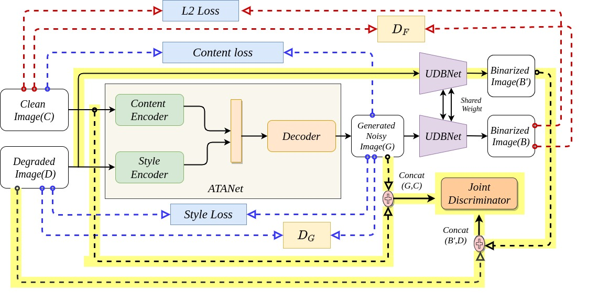
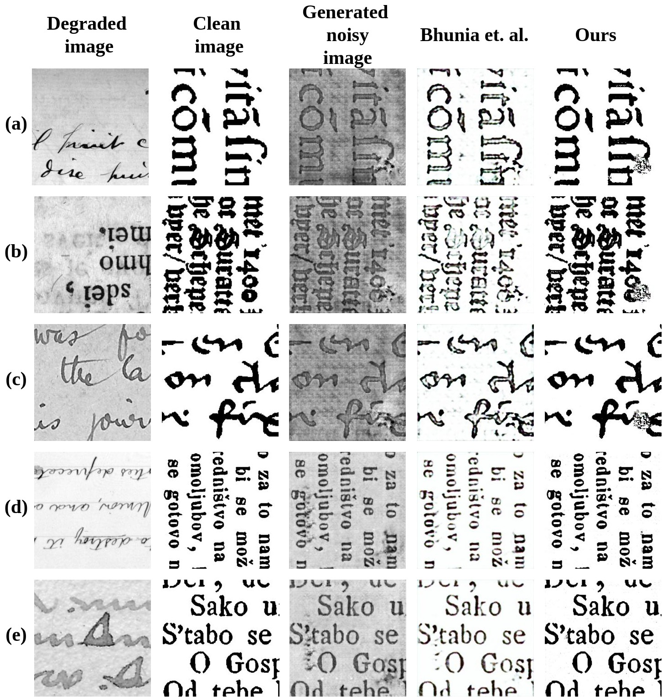
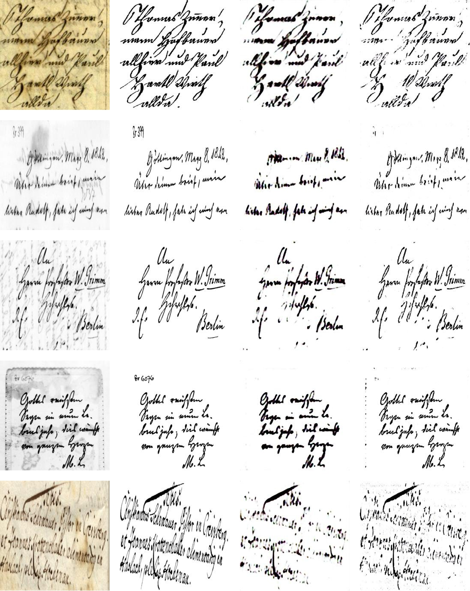

# UDBNET: Unsupervised Document Binarization Network via Adversarial Game [[paper](https://arxiv.org/abs/2007.07075)]
Amandeep Kumar*, Shuvozit Ghose*, Pinaki Nath Chowdhury, Partha Pratim Roy, Umapada Pal 

## Abstract
Degraded document image  binarization is one of most challenging tasks in the domain of document image analysis. In this paper, we present a novel approach towards document image binarization by introducing three player min-max adversarial game. We train the network in the unsupervised setup by assuming that we do not have any paired-training data. In our approach, an Adversarial Texture Augmentation Network (ATANet) first superimposes the texture of a degraded reference image over a clean image. Later, the clean image along with its generated degraded version constitute the pseudo paired-data which is used to train the Unsupervised Document Binarization Network (UDBNet). Following this approach, we have enlarged the document binarization datasets as it generates multiple images having same content feature but different textual feature. These generated noisy images is then fed into the Unsupervised Document Binarization Network(UDBNet) to get back the clean version. The joint discriminator which is third player of our three player min-max adversarial game tries to couple both the Adversarial Texture Augmentation Network (ATANet) and Unsupervised Document Binarization Network (UDBNet). The three player min-max adversarial game comes to an end, when the distributions modelled by the Adversarial Texture Augmentation Network (ATANet) and the Unsupervised Document Binarization Network (UDBNet) align to the same joint distribution over time. Thus, the joint discriminator enforces the Unsupervised Document Binarization Network (UDBNet) to perform better on real degraded image. The experimental results indicate the superior performance of the proposed model over existing state-of-the-art algorithm on widely used DIBCO datasets.

### Architecture



### Quantative Results on Training Set



### Quantative Results on Test Set


## Citation
If you find this work useful in your research, please consider citing: 
```
@article{kumar2020udbnet,
  title={UDBNET: Unsupervised Document Binarization Network via Adversarial Game},
  author={Kumar, Amandeep and Ghose, Shuvozit and Chowdhury, Pinaki Nath and Roy, Partha Pratim and Pal, Umapada},
  journal={arXiv preprint arXiv:2007.07075},
  year={2020}
}
```
